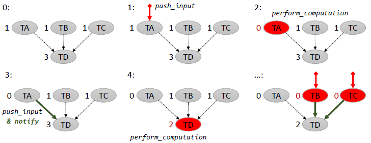

# Operating Systems Lab 2017 - Exam 2 #

In this exercise, a simple threaded computation system should be implemented. 
The system takes a number of inputs and calculates their maximum by propagating a value across nodes.
A sequential implementation of the system is provided.

Each node in the task graph should be managed by one thread, and each of them can have multiple inputs (at least one) and produces one output.

### Structure of this repository ###

These files are available in the repository:

* a `Makefile` for building the program
* `bs_exam2_task2.[h/c]` contains the existing sequential implementation which should be extended to include threads
* `main.c` which implements a test program that is already pre-defined

### Your task ###

Extend the functions `create_node`, `destroy_node`, `push_input`, `perform_computation` and `wait_for_node` 
to work in parallel with one thread per node as outlined in
`bs_exam2_task2.h`. For details, refer to the comments provided with each function declaration. 

Take note that:

* You are **not** allowed to change the interface of any of these functions or the main program
* You **are** allowed to add additional data members to the `graph_node` structure as required for synchronization

### The big picture ###

The following picture illustrates 4 `graph_node` structures and their state over time. The number to the left of each node is its current `num_inputs_needed` value.

TA, TB and TC have one input each (`num_inputs_needed=1`), and their `target` is TD. TD has 3 inputs and no output.

In the current sequential version, when an input is pushed to a node (step 1), its computation is immediately performed
and its `num_inputs_needed` is reduced (step 2). If the number reaches 0, the output of the node is pushed to its target (if any),
and the target is notified that new input is available.

In the provided sequential version, this "notification" is simply calling `perform_computation` (step 3). 
In the parallel version, to push a new value,
a source task has to ensure that it has exclusive access to its target, then write the value to it, and finally notify the
target using a condition variable that it can now perform its computation.

This mutually exclusive access guarantee is important in a case as illustrated in the final picture, where TB and TC complete a
calculation at the same time.